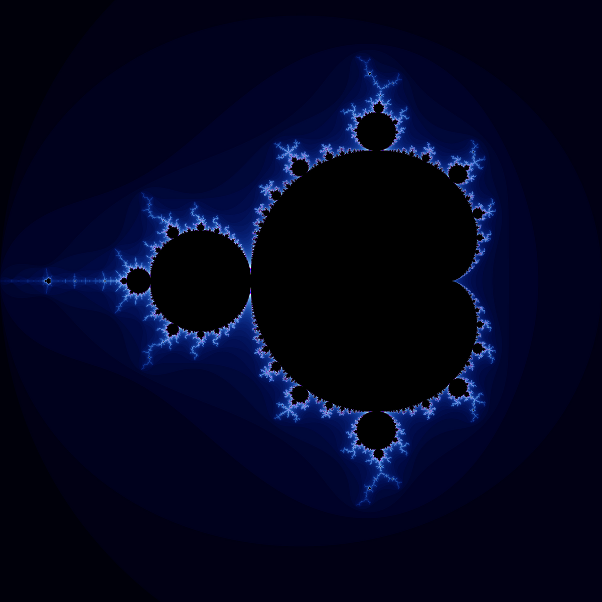
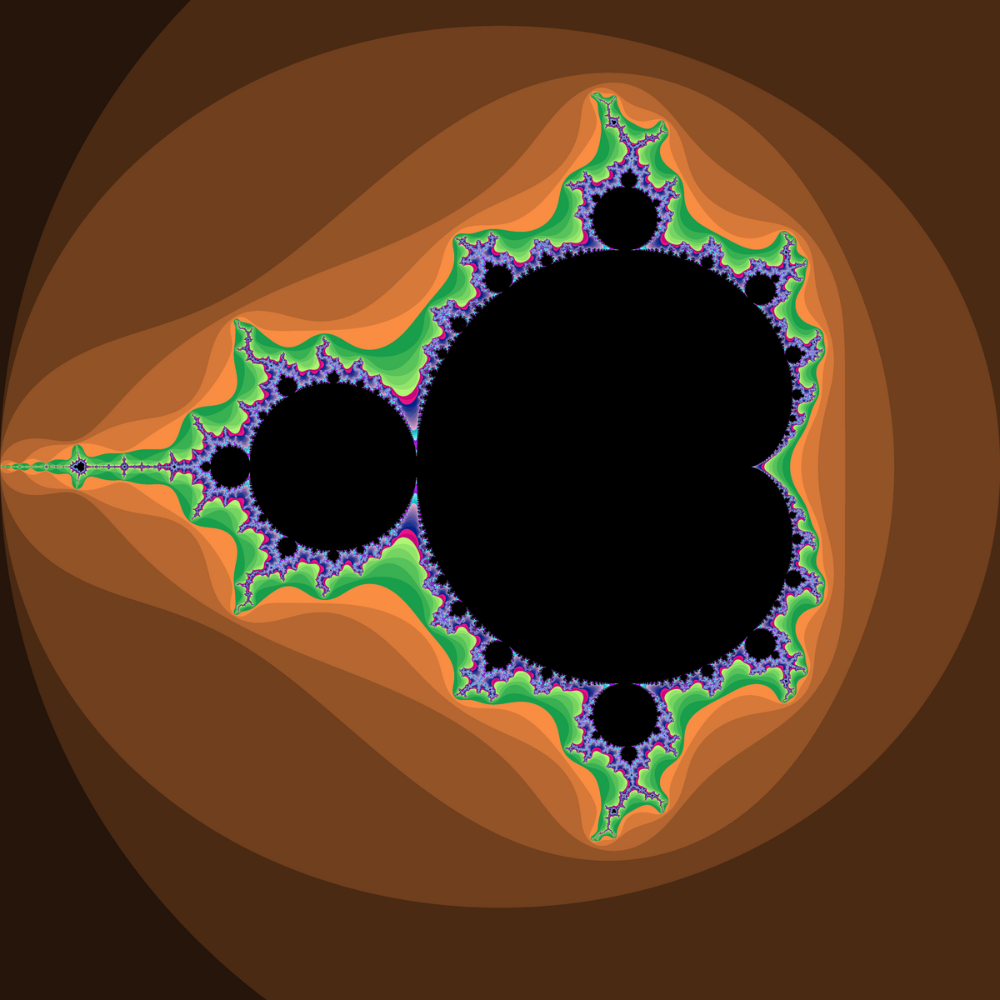
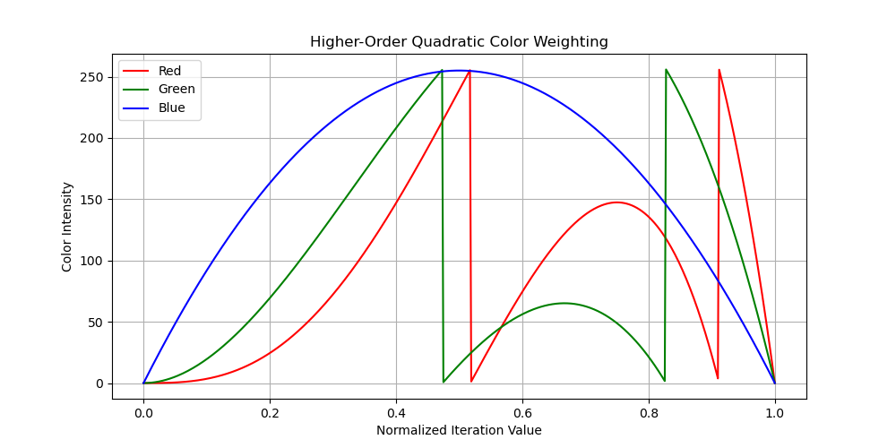
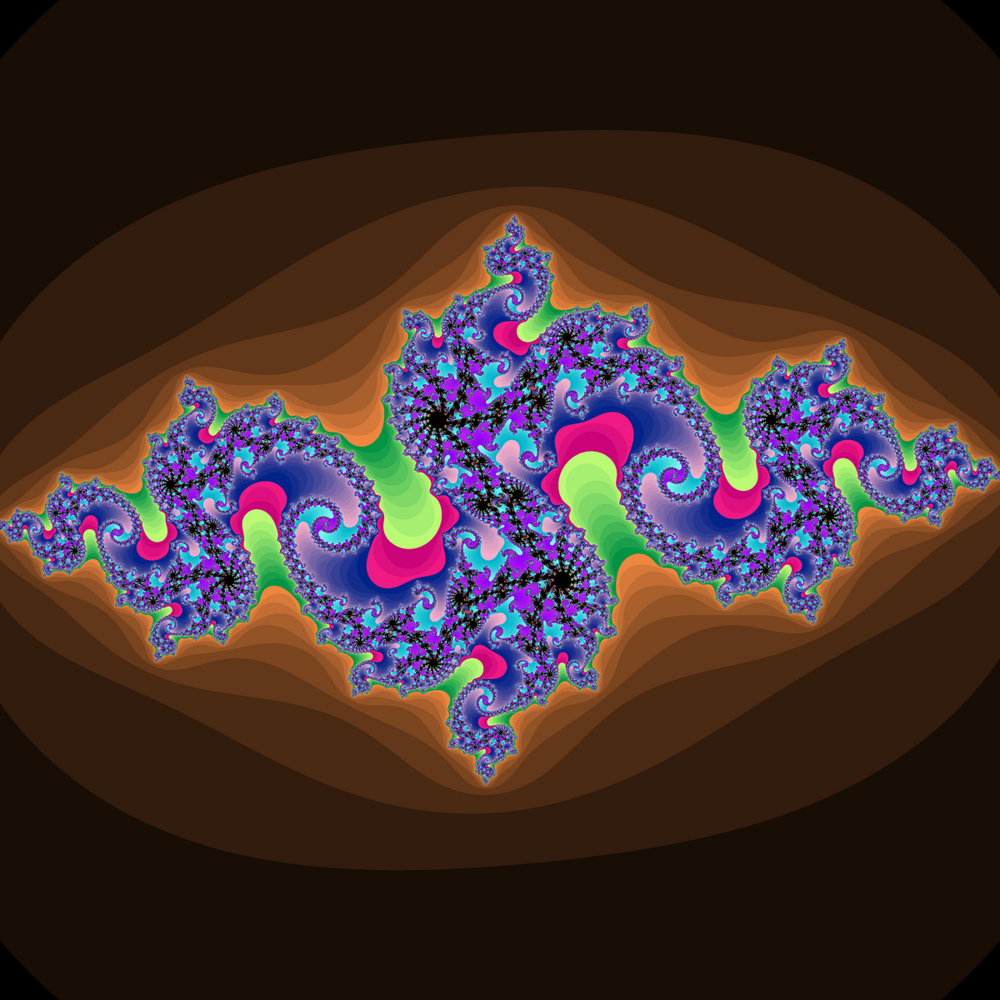

The Mandelbrot set is visualized on the [complex plane](https://en.wikipedia.org/wiki/Complex_plane), where it is calculated until it either hits the maximum iteration number or diverges. The escape time (number of iterations) determines the pixel value and, in this example, is assigned a color corresponding to the number of iterations it takes to escape. The points where the Mandelbrot set exists are colored black, while points outside the set are assigned colors based on how long they take to diverge.



**The iterative formula**:

$$ 
z\_{n+1} = z\_n^2 + z\_0 
$$
$$ z\_0 = 1 $$

---

```cpp
while(iterations < MAX_ITER &&(z_real * z_real + z_imaginary * z_imaginary) <= 2.0)
```

```cpp
int mandelbrot(double real, double imaginary){
    int iterations = 0 ;
    double z_real = 0.0  , z_imaginary = 0.0;

    while (iterations < MAX_ITER && (z_real * z_real + z_imaginary * z_imaginary) <= 2.0) {
        double z_real_next = z_real * z_real - z_imaginary * z_imaginary + real;
        z_imaginary       = 2.0 * z_real * z_imaginary + imaginary;
        z_real            = z_real_next;
        iterations++;
    }

    return iterations;
}
```

Here is the primary function used to generate the Mandelbrot set and Julia set. I used the escape version of the algorithm. For each iteration, we check the number of iterations and the distance from the center. This is because the Mandelbrot set only extends to a distance of 2. If ∣z∣ becomes greater than 2, we assume that the point "escapes." If we reach the maximum number of iterations before the point escapes, we say this point belongs to the Mandelbrot set. The iteration count is stored, and this is what we use for coloring each pixel.

---

### Optimizing Space using Row-Major

Inorder to save space and to prepare for the bitmap generation we use a row major format this is how we will store the color channels for each pixel.
[Row-Major](https://en.wikipedia.org/wiki/Row-_and_column-major_order#:~:text=In%20row%2Dmajor%20order%2C%20the,column%20in%20column%2Dmajor%20order.)

```cpp
    std::vector<uint8_t> image(WIDTH * HEIGHT * 3); 
```

---

### Converting Complex Numbers to Cartesian Coordinates

the mandelbrot set is plotted on the complex plane, where each point is represented by

$$c = x + yi$$

- X: real part, mapped to the horixontal axis
- Y: imaginary part, mapped to the vertical axis
  
To display the Mandelbrot set on the Cartesian plane, we use a linear mapping that translates points from the complex plane. The set is confined to the region where the real axis spans [-2, 2] and the imaginary axis spans [-2, 2], as points outside this area diverge too quickly to contribute to the set.

[Plotting Algoritums](https://en.wikipedia.org/wiki/Plotting_algorithms_for_the_Mandelbrot_set)

---

### Coloring

Once the number of iterations has been calculated, we can apply coloring to the data. Two different methods are used to achieve this, each producing drastically different outcomes. A quadratic weight function is used to determine the value of each color. Additionally, a color multiplier is applied to adjust the ratio of colors, allowing for greater control over the final appearance.

```cpp
    r = static_cast<uint8_t>(color_mut[0] * (1 - iter_normal)  * iter_normal * 255);
    g = static_cast<uint8_t>(color_mut[1] * (1 - iter_normal)  * iter_normal * 255);
    b = static_cast<uint8_t>(color_mut[2] * (1 - iter_normal)  * iter_normal * 255);
```

<div style="display: flex; gap: 20px; justify-content: center;">
    
    
</div>

As you can see from the images in this example, the color is more banded, meaning there are more distinct lines in the images, and the colors are not blended as much. The graph on the left represents the colors based on the number of iterations.

```cpp
    r = static_cast<uint8_t>(color_mut[0] * (1 - iter_normal) * iter_normal * iter_normal * iter_normal * 255);
    g = static_cast<uint8_t>(color_mut[1] * (1 - iter_normal) * iter_normal * iter_normal * 255);
    b = static_cast<uint8_t>(color_mut[2] * (1 - iter_normal) * iter_normal * 255);

```

<div style="display: flex; gap: 20px; justify-content: center;">
    
    
</div>

Even though the iteration numbers remain unchanged, we get completely different results by altering the way we color the set. In this example, we use a higher-order polynomial. The graph shows how each of the red, green, and blue values is calculated. The blue values have a parabolic shape, making blue the dominant color, even though it has a low color multiplier of only 4 in this example.

---

## Juilia set

The Julia Set is related to the mandelbort set but using a constant complex number to generte. When the constant is changed the julia set is whole new julia set here some examples of differnt constants for the julia set.

$$ z\_{n+1} = z\_n^2 + c $$

<div style="display: flex; gap: 20px; justify-content: center;">
    
    
</div>

The iterative formula for the julia set you can see it is very similar to the mandelbort set with the only differnce being the constant is a fixed value.

$$ z\_{n+1} = z\_n^2 + c $$

In the Julia set, the behavior of the sequence starting at an arbitary \\( z\_0 \\) is analyed for a fixed comlpex constant C. Like the madelbort set, the interation stops if \\(|z\_0| > 2 \\), as this indicates the sequesnce will escape to infinity.The choice of c greatly affects the appearance of the Julia set, producing either connected, intricate fractals or completely disconnected "dust-like" structures. For example, c = -0.4+0.6i produces a connected fractal, while c = 0.355 + 0.355i results in a dust-like pattern. the process of generating Julia set is conputaonally very similar to the mandelbrot set.