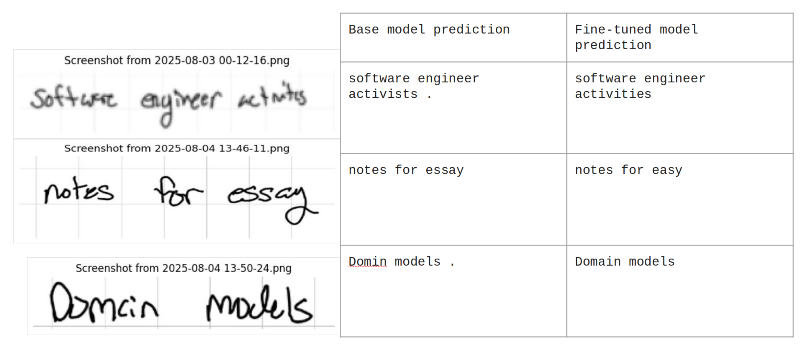
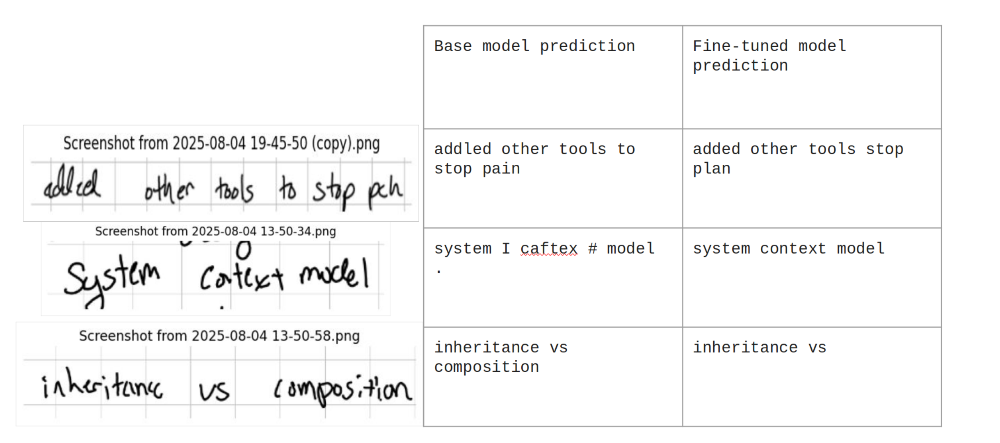


[GitHub](https://github.com/gardnerjaaron/Personal_Handwriting_recognition)


This project will evaluate and fine-tune a pre-trained handwriting model, [TrOCR](https://arxiv.org/pdf/2109.10282)  on a dataset of the last 3.5 years of digitized notes(still getting a total count ~200 pages).
## Motivation 
- Handwriting can be highly stylized from person-to-person. 
- In some cases  OCR can stuggle to understand words which are written in a unique style which.


## What’s in this project
- **Custom dataset loading**: Line images and transcriptions from your own notes.

- **Image augmentation**: Slight rotations, brightness changes, and blur to improve generalization.

- **Training**: Fine-tunes microsoft/trocr-base-handwritten using Hugging Face’s Seq2SeqTrainer.

- **Evaluation** – Compares accuracy and character similarity between the base and fine-tuned model.

## Pages
I used a total of 135 pages handwritten notes. Each page is broken into line segments totaling 1600 images. Lines with to much noise were cleaned out and any with math notation as well. 

The dataset is as follows `line_data/images` folder for all images, a CSV at line_data for root path to each image and its associated text. 

## Augmentations
I used pretty simple augmentations for this it helped with over-fitting.
```python
from torchvision import transforms
train_transforms = transforms.Compose([
    transforms.Resize((384, 384)),
    transforms.RandomRotation(degrees=(-2, 2), fill=255),
    transforms.ColorJitter(brightness=(0.9, 1.1), contrast=(0.95, 1.05)),
    transforms.RandomApply([
        transforms.GaussianBlur(kernel_size=3, sigma=(0.1, 0.5))
    ], p=0.2),
])
# For validation (only resize)
val_transforms = transforms.Compose([
    transforms.Resize((384, 384)),
])
```

## Training configuration
basemodel is the microsoft/trocr-base-handwritten fine-tuning to our dataset.
- Batchsize: 2 
- Epochs : 4
- learning rate : 1e-5

## Results
- This is a 50/50 split for evaluation on the dataset


- Some inference examples which didn't appear in the dataset

